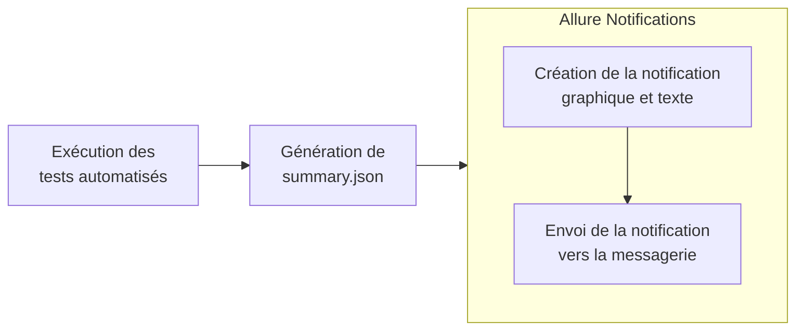

[](README.md) [](README.ru.md) [](#)

# Allure notifications
**Allure notifications** est une bibliothèque qui envoie automatiquement des notifications sur les résultats des tests automatisés vers la messagerie de votre choix (Telegram, Slack, ~~Skype~~, Email, Mattermost, Discord, Loop, Rocket.Chat, Zoho Cliq, Microsoft Teams).

Langues des notifications : 🇬🇧 🇫🇷 🇷🇺 🇺🇦 🇧🇾 🇨🇳

## Sommaire
+ [Fonctionnement](#fonctionnement)
+ [Aperçu des notifications](#aperçu-des-notifications)
+ [Utilisation dans votre projet](#utilisation-dans-votre-projet)
  + [Exécution locale](#exécution-locale)
  + [Exécution depuis Jenkins](#exécution-depuis-jenkins)
+ [Configuration config.json par messagerie](#configuration-configjson-par-messagerie)


## Fonctionnement
À la fin de l'exécution des tests automatisés, un fichier `summary.json` est généré dans le dossier `allure-report/widgets`. Ce fichier contient les statistiques générales des résultats de tests, à partir desquelles la notification est construite (un graphique est dessiné et le texte correspondant est ajouté).



Exemple de fichier `summary.json` :
```json
{
  "reportName" : "Allure Report",
  "testRuns" : [ ],
  "statistic" : {
    "failed" : 182,
    "broken" : 70,
    "skipped" : 118,
    "passed" : 439,
    "unknown" : 42,
    "total" : 851
  },
  "time" : {
    "start" : 1590795193703,
    "stop" : 1590932641296,
    "duration" : 11311,
    "minDuration" : 7901,
    "maxDuration" : 109870,
    "sumDuration" : 150125
  }
}
```
Si le plugin Allure Summary est connecté, un fichier `suites.json` sera également généré et ses données seront incluses dans les statistiques.


## Aperçu des notifications
Exemple de notification dans Telegram


## Utilisation dans votre projet

### Exécution locale
1. Installez Java (non requis pour une exécution depuis Jenkins).
2. Créez un dossier `notifications` à la racine de votre projet.
3. [Téléchargez](https://github.com/qa-guru/allure-notifications/releases) la dernière version du fichier `allure-notifications-<version>.jar` et placez-le dans le dossier `notifications`.
4. Dans le dossier `notifications`, créez un fichier `config.json` avec la structure suivante (conservez la section `base` et uniquement le bloc de la messagerie souhaitée) :
```json
{
  "base": {
    "logo": "",
    "project": "",
    "environment": "",
    "comment": "",
    "reportLink": "",
    "language": "fr",
    "allureFolder": "",
    "enableChart": false,
    "darkMode": false,
    "enableSuitesPublishing": false,
    "customData": {}
  },
  "telegram": {
    "token": "",
    "chat": "",
    "topic": "",
    "replyTo": "",
    "templatePath": "/templates/telegram.ftl"
  },
  "slack": {
    "token": "",
    "chat": "",
    "replyTo": "",
    "templatePath": "/templates/markdown.ftl"
  },
  "mattermost": {
    "url": "",
    "token": "",
    "chat": "",
    "templatePath": "/templates/markdown.ftl"
  },
  "rocketChat" : {
    "url": "",
    "auth_token": "",
    "user_id": "",
    "channel": "",
    "templatePath": "/templates/rocket.ftl"
  },
  "mail": {
    "host": "",
    "port": "",
    "username": "",
    "password": "",
    "securityProtocol": null,
    "from": "",
    "to": "",
    "cc": "",
    "bcc": "",
    "templatePath": "/templates/html.ftl"
  },
  "discord": {
    "botToken": "",
    "channelId": "",
    "templatePath": "/templates/markdown.ftl"
  },
  "loop": {
    "webhookUrl": "",
    "templatePath": "/templates/markdown.ftl"
  },
  "cliq": {
    "token": "",
    "chat": "",
    "bot": "",
    "dataCenter": "eu",
    "templatePath": "/templates/markdown.ftl"
  },
  "teams": {
    "webhookUrl": "",
    "templatePath": "/templates/teams.ftl"
  },
  "proxy": {
    "host": "",
    "port": 0,
    "username": "",
    "password": ""
  }
}
```
Le bloc `proxy` est utilisé pour spécifier une configuration proxy supplémentaire.  
Le paramètre `templatePath` est optionnel et permet de définir le chemin vers un modèle Freemarker personnalisé. Exemple :
```json
{
  "base": { "..." : "..." },
  "mail": {
    "host": "smtp.gmail.com",
    "port": "465",
    "username": "username",
    "password": "password",
    "securityProtocol": "SSL",
    "from": "test@gmail.com",
    "to": "test1@gmail.com",
    "cc": "testCC1@gmail.com, testCC2@gmail.com",
    "bcc": "testBCC1@gmail.com, testBCC2@gmail.com",
    "templatePath": "/templates/html_custom.ftl"
  }
}
```

5. Remplissez le bloc `base` dans `config.json` :
```json
"base": {
    "project": "mon projet",
    "environment": "production",
    "comment": "commentaire",
    "reportLink": "",
    "language": "fr",
    "allureFolder": "build/allure-report/",
    "enableChart": true,
    "darkMode": true,
    "enableSuitesPublishing": true,
    "logo": "logo.png",
    "durationFormat": "HH:mm:ss.SSS",
    "customData": {
      "variable1": "valeur1",
      "variable2": "valeur2"
    }
}
```
Description des champs :
+ `project`, `environment`, `comment` — nom du projet, nom de l'environnement et commentaire libre.
+ `reportLink` — lien vers le rapport Allure (utile lors d'une exécution depuis Jenkins).
+ `language` — langue de la notification (`en` / `fr` / `ru` / `ua` / `by` / `cn`).
+ `allureFolder` — chemin vers le dossier contenant les résultats Allure.
+ `enableChart` — afficher ou non le graphique (`true` / `false`).
+ `darkMode` — afficher le graphique en mode sombre (`true` / `false`).
+ `enableSuitesPublishing` — publier les statistiques par suite de tests (`true` / `false`, par défaut `false`). Nécessite la présence de `suites.json` dans `<allureFolder>/widgets`.
+ `logo` — chemin vers un fichier logo ; s'il est défini, le logo s'affiche dans le coin supérieur gauche du graphique.
+ `durationFormat` (optionnel, par défaut `HH:mm:ss.SSS`) — format d'affichage de la durée des tests.
+ `customData` — données supplémentaires disponibles dans les modèles Freemarker personnalisés (optionnel).

6. Remplissez le bloc de la messagerie souhaitée : voir [Configuration config.json par messagerie](#configuration-configjson-par-messagerie).

7. Exécutez la commande suivante dans votre terminal :
```shell
java "-DconfigFile=notifications/config.json" -jar notifications/allure-notifications-4.11.0.jar
```
Remarques :
+ Le fichier `summary.json` doit déjà exister au moment de l'exécution.
+ Indiquez la version du jar que vous avez téléchargée.
+ Les paramètres peuvent être surchargés via les propriétés système (elles ont priorité sur `config.json`) :
```shell
java "-DconfigFile=notifications/config.json" \
  "-Dnotifications.base.environment=${STAND}" \
  "-Dnotifications.base.reportLink=${ALLURE_SERVICE_URL}" \
  "-Dnotifications.base.project=${PROJECT_ID}" \
  "-Dnotifications.telegram.token=${TG_BOT_TOKEN}" \
  "-Dnotifications.telegram.chat=${TG_CHAT_ID}" \
  "-Dnotifications.telegram.topic=${TG_CHAT_TOPIC_ID}" \
  -jar allure-notifications.jar
```
ℹ️ Les préfixes des propriétés `customData` sont supprimés : `-Dbase.customData.variable1=someValue` devient la clé `variable1` avec la valeur `someValue`.  
⚠️ L'utilisation de `base.customData.` sans nom de paramètre est également valide.


### Exécution depuis Jenkins
1. Ouvrez la configuration de build dans Jenkins.
2. Dans la section **Build**, cliquez sur **Ajouter une étape de build** → **Create/Update Text File**.


Remplissez comme indiqué ci-dessous :


Remarques :
+ La description du bloc `base` est disponible [ci-dessus](#5-remplissez-le-bloc-base-dans-configjson).
+ Utilisez des variables Jenkins comme valeurs : `"project": "${JOB_BASE_NAME}"` et `"reportLink": "${BUILD_URL}"`.
+ La configuration par messagerie est décrite dans la [section suivante](#configuration-configjson-par-messagerie).

3. Dans la section **Actions à la suite du build**, cliquez sur **Ajouter une action** → **Post build task**.


Dans le champ **Script**, saisissez :
```bash
cd ..
FILE=allure-notifications-4.11.0.jar
if [ ! -f "$FILE" ]; then
   wget https://github.com/qa-guru/allure-notifications/releases/download/4.11.0/allure-notifications-4.11.0.jar
fi
```
Cliquez sur **Add another task** et dans le second champ **Script** saisissez :
```bash
java "-DconfigFile=notifications/config.json" -jar ../allure-notifications-4.11.0.jar
```

4. Sauvegardez la configuration et lancez vos tests. Une notification sera envoyée à la messagerie configurée à la fin de l'exécution.


## Configuration config.json par messagerie
+ <a href="https://github.com/qa-guru/knowledge-base/wiki/12.-Телеграм-бот.-Отправляем-уведомления-о-результатах-прохождения-тестов" target="_blank">Configuration Telegram</a>
  + Paramètres du bloc `telegram` :
    <ul>
      <li><code>topic</code> — paramètre optionnel définissant l'identifiant unique du fil de discussion (topic) cible. Consultez <a href="https://stackoverflow.com/questions/74773675/how-to-get-topic-id-for-telegram-group-chat">Stackoverflow</a> pour obtenir cette valeur.</li>
    </ul>
+ <a href="https://github.com/qa-guru/allure-notifications/wiki/Slack-configuration" target="_blank">Configuration Slack</a>
+ <a href="https://github.com/qa-guru/allure-notifications/wiki/Email-configuration" target="_blank">Configuration Email</a>
+ <a href="https://github.com/qa-guru/allure-notifications/wiki/Mattermost-configuration" target="_blank">Configuration Mattermost</a>
+ <details>
    <summary>Configuration Discord</summary>
    Pour activer les notifications Discord, fournissez <code>botToken</code> et <code>channelId</code>.
    <ul>
      <li>Création du bot et obtention du token :
        <ol>
          <li>Activez le "Mode développeur" dans les paramètres Discord.</li>
          <li>Ouvrez le portail Discord API → "Applications" → "New Application".</li>
          <li>Nommez l'application et cliquez "Create".</li>
          <li>Dans "Bot", cliquez "Add Bot" et copiez le token dans le config JSON.</li>
          <li>Dans "OAuth2", activez "bot", définissez les permissions et copiez le lien d'invitation pour ajouter le bot à votre serveur.</li>
        </ol>
      </li>
      <li>Pour obtenir un Channel ID : clic droit sur le canal → "Copier l'identifiant", puis collez-le dans le config JSON.</li>
    </ul>
  </details>
+ <details>
    <summary>Configuration Loop</summary>
    Création d'un webhook URL pour Loop :
    <ul>
      <li>Ouvrez le menu principal de l'application Loop.</li>
      <li>Cliquez sur "Intégrations" → "Webhooks entrants" → "Ajouter un webhook entrant".</li>
      <li>Remplissez le formulaire, sélectionnez un canal et cliquez "Enregistrer".</li>
      <li>Copiez l'URL du webhook dans le config JSON.</li>
    </ul>
  </details>
+ <details>
    <summary>Configuration Rocket.Chat</summary>
    Paramètres requis : <code>url</code>, <code>auth_token</code>, <code>user_id</code>, <code>channel</code>.
    <ol>
      <li>Générez un <code>auth_token</code> depuis les paramètres utilisateur — vous y trouverez également le <code>user_id</code>.</li>
      <li>Récupérez le nom du canal via l'<a href="https://developer.rocket.chat/reference/api/rest-api/endpoints/rooms/channels-endpoints/info" target="_blank">API REST Rocket.Chat</a>.</li>
    </ol>
  </details>
+ <details>
    <summary>Configuration Zoho Cliq</summary>
    Paramètres requis :
    <ul>
      <li><code>token</code> — votre token API Zoho Cliq (zapikey). Pour l'obtenir :
        <ol>
          <li>Accédez aux paramètres de votre compte Zoho Cliq.</li>
          <li>Naviguez vers "Bots &amp; Outils" → "Bot".</li>
          <li>Créez un nouveau bot ou utilisez un existant.</li>
          <li>Copiez le token (zapikey) depuis le "Webhook URL".</li>
        </ol>
      </li>
      <li><code>chat</code> — nom du canal où envoyer les notifications.</li>
      <li><code>bot</code> — (optionnel) nom unique du bot pour l'envoi des messages.</li>
      <li><code>dataCenter</code> — région du centre de données Zoho :
        <ul>
          <li><code>com</code> — États-Unis (cliq.zoho.com)</li>
          <li><code>eu</code> — Europe (cliq.zoho.eu) — par défaut</li>
          <li><code>in</code> — Inde (cliq.zoho.in)</li>
          <li><code>au</code> — Australie (cliq.zoho.com.au)</li>
          <li><code>jp</code> — Japon (cliq.zoho.jp)</li>
          <li><code>ca</code> — Canada (cliq.zohocloud.ca)</li>
        </ul>
      </li>
    </ul>
    Pour plus d'informations, consultez la <a href="https://www.zoho.com/cliq/help/restapi/v2/" target="_blank">documentation officielle de l'API Zoho Cliq</a>.
  </details>
+ <details>
    <summary>Configuration Microsoft Teams</summary>
    Les notifications sont envoyées sous forme d'Adaptive Card vers une URL de webhook Teams générée par l'application <strong>Workflows</strong> (Power Automate). Les connecteurs Microsoft 365 (l'ancien « Incoming Webhook ») sont <a href="https://devblogs.microsoft.com/microsoft365dev/retirement-of-office-365-connectors-within-microsoft-teams/" target="_blank">en cours de retrait</a> — utilisez Workflows pour les nouvelles intégrations.
    <p>Le seul paramètre requis est <code>webhookUrl</code>.</p>
    <strong>Comment obtenir l'URL du webhook :</strong>
    <ol>
      <li>Dans Microsoft Teams, ouvrez l'équipe et le canal cibles.</li>
      <li>Cliquez sur <strong>Autres options (…)</strong> à côté du canal → <strong>Workflows</strong>.</li>
      <li>Choisissez le modèle <em>« Post to a channel when a webhook request is received »</em>.</li>
      <li>Configurez les paramètres et cliquez sur <strong>Save</strong>.</li>
      <li>Copiez l'URL de webhook générée et collez-la dans le champ <code>teams.webhookUrl</code> de <code>config.json</code>.</li>
    </ol>
    Pour plus de détails, consultez la <a href="https://learn.microsoft.com/en-us/microsoftteams/platform/webhooks-and-connectors/how-to/add-incoming-webhook" target="_blank">documentation officielle de Microsoft Teams</a>.
    <p><strong>Notes et limitations</strong> (selon la documentation Teams) :</p>
    <ul>
      <li>Le graphique (si <code>enableChart=true</code>) est intégré à l'Adaptive Card en tant qu'image base64 — aucun hébergement externe n'est requis.</li>
      <li>La taille totale du message doit être ≤ <strong>28 Ko</strong>. Pour des graphiques très volumineux, il peut être nécessaire de les désactiver ou de les héberger en externe.</li>
      <li>Teams limite la fréquence des requêtes à <strong>4 requêtes/seconde</strong>.</li>
      <li>L'Adaptive Card utilise <code>$schema</code> <code>http://adaptivecards.io/schemas/adaptive-card.json</code>, version <code>1.5</code>. Pour personnaliser la carte, fournissez votre propre modèle via <code>templatePath</code> — son contenu devient le champ <code>TextBlock.text</code> (Markdown supporté par Teams : <code>**gras**</code>, <code>_italique_</code>, listes, liens).</li>
    </ul>
  </details>
