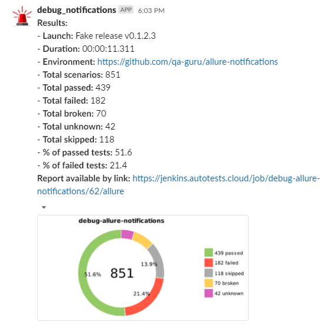
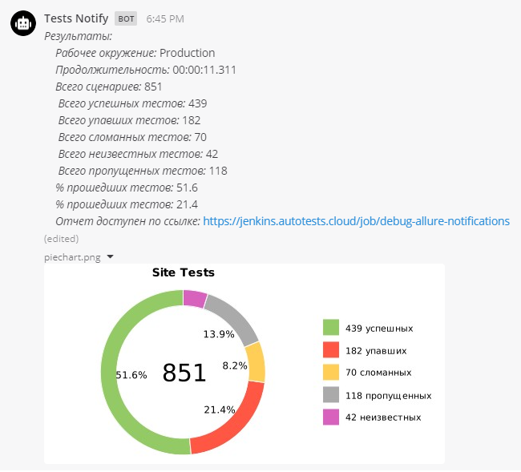
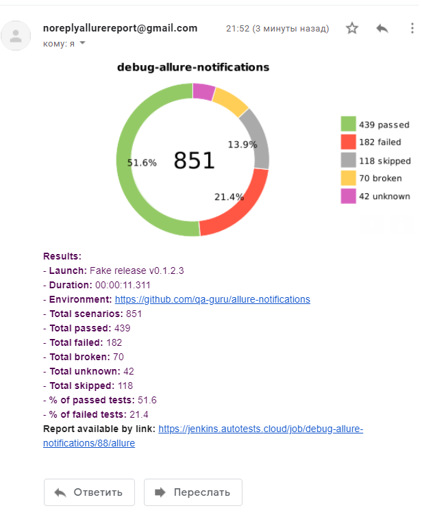

<h1>Allure notifications :sun_with_face:</h1>
<h6>for telegram, slack, skype, email, mattermost</h6>

<h3>Languages:</h3>

   </h5>

| Telegram | Slack |
:-------------------------:|:-------------------------:
 | 
| **Mattermost** | **Email** |
 |  
| **Skype** |  |
| `// todo` [#32](https://github.com/qa-guru/allure-notifications/issues/32) :nerd_face::computer: |  |


<h6>How to:</h6>

- [x] [Telegram config](https://github.com/qa-guru/allure-notifications/wiki/Telegram-configuration)
- [x] [Slack config](https://github.com/qa-guru/allure-notifications/wiki/Slack-configuration)
- [ ] [Email config](https://github.com/qa-guru/allure-notifications/wiki/Email-configuration)
- [x] [Skype config](https://github.com/qa-guru/allure-notifications/wiki/Skype-Bot-Configuration)
- [x] [Mattermost config](https://github.com/qa-guru/allure-notifications/wiki/Skype-configuration)


<h6>CommandLine options</h6>
All keys should be used with `-D`: <br/> 

| key | description | 
|:---:| :---------: |
| projectName | Name of project |
| env | Environment (Test, Prod, etc.) name |
| reportLink | Jenkins Build URL |
| config.file | Path to JSON-config file |

```
java  \
"-DprojectName=${PROJECT_NAME}" \
"-Dconfig.file=${PATH_TO_FILE}" \
"-Denv=${ENVIRONMENT}" \
"-DreportLink=${BUILD_URL}" \
-jar allure-notifications-3.0.1.jar
```

<h6>Config file structure</h6>
Here you can find config file structure for lib configuration.

```json
{
  "app": {
    "bot": {
      "token": "",
      "chat": "",
      "replyTo": ""
    },
    "base": {
      "lang": "",
      "messenger": "",
      "allureFolder": "",
      "mattermostUrl": "",
      "chart": false,
      "chartName": "",
      "project": ""
    },
    "mail": {
      "host": "",
      "port": "",
      "username": "",
      "password": "",
      "enableSSL": false,
      "from": "",
      "recipient": ""
    },
    "proxy": {
      "host": "",
      "port": 0,
      "username": "",
      "password": ""
    },
    "skype": {
      "appId": "",
      "appSecret": "",
      "serviceUrl": "",
      "conversationId": "",
      "botId": "",
      "botName": ""
    }
  }
}
```
You only need to feel needed options in `bot`, `base`, `mail` or `proxy` section. Please, be careful, `lang` and `messenger` fields are required!

Example for Telegram messenger:
```json
{
  "app": {
    "bot": {
      "token": "asdhsdgfjsdfgFgjhg4831)@",
      "chat": "-1",
      "replyTo": ""
    },
    "base": {
      "lang": "en",
      "messenger": "telegram",
      "allureFolder": "src/test/",
      "mattermostUrl": "",
      "chart": true,
      "chartName": "",
      "project": ""
    },
    "mail": {
      "host": "",
      "port": "",
      "username": "",
      "password": "",
      "enableSSL": false,
      "from": "",
      "recipient": ""
    },
    "proxy": {
      "host": "",
      "port": 0,
      "username": "",
      "password": ""
    },
    "skype": {
      "appId": "",
      "appSecret": "",
      "serviceUrl": "",
      "conversationId": "",
      "botId": "",
      "botName": ""
    }
  }
}
```
