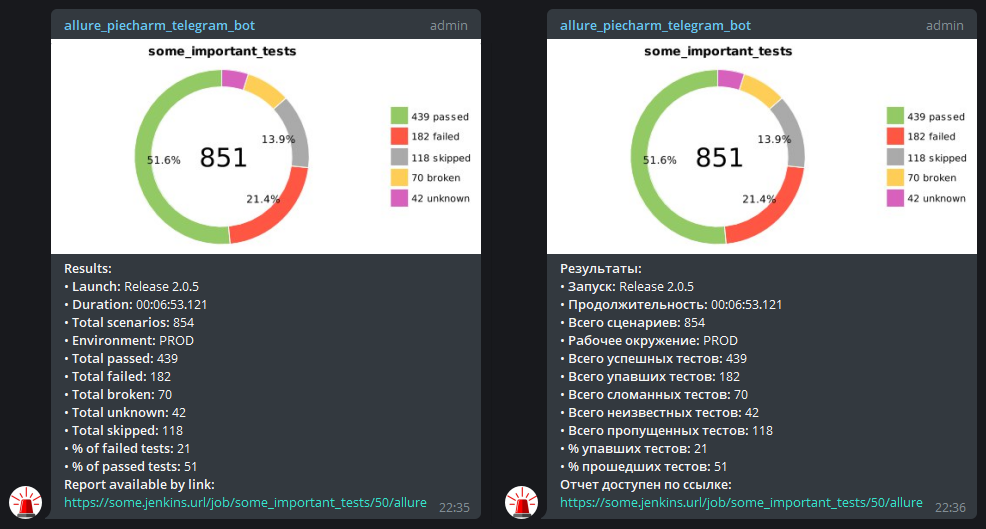
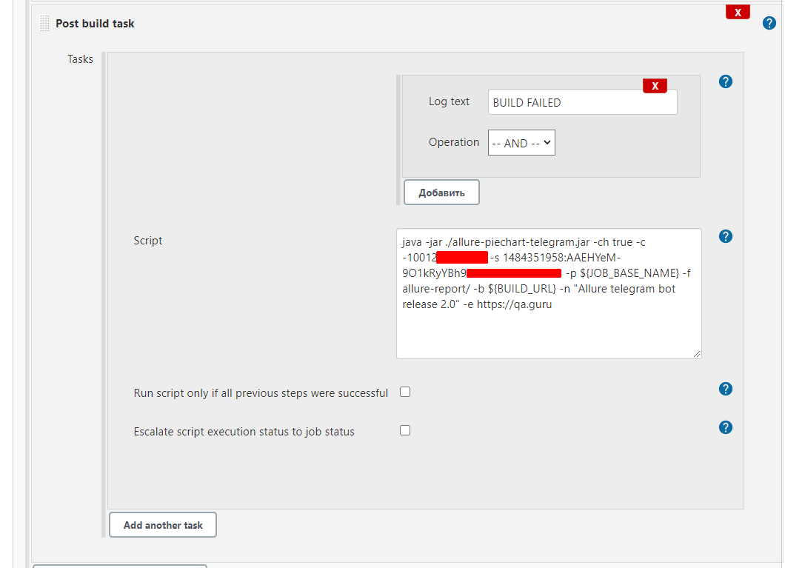

<h3>Allure piechart telegram script</h3>

jar, that draws piechart from results `allure-report/export/prometheusData.txt` and sends it with link to build to telegram-chat

0. Create telegram bot in @BotFather and add it to your chat. 
Remember <b>telegram bot secret</b> 
Remember <b>telegram chat id</b>, you can find here -> https://api.telegram.org/bot{telegram_bot_secret}/getUpdates
1. You can download ready jar https://github.com/svasenkov/allure-piechart-telegram/blob/master/build/libs/allure-piechart-telegram-1.0.jar or clone project and build .jar yourself:
`gradle jar` -> build/libs/allure-piechart-telegram-1.0.jar
2. Put allure-piechart-telegram-1.0.jar in your in root folder of your autotests project.
3. Run it after allure-report is generated, 
for example Jenkins postbuild task:
`java -jar allure-piechart-telegram-1.0.jar "telegram_chat_id" "telegram_bot_secret" "${JOB_BASE_NAME}" "allure-report/" ${BUILD_URL}`

<h3>CommandLine options</h3>
You can run post build task using cmd options: 
`-ch - Enable/disable PieChart diagram (false by default);`  
`-s - Set telegram bot secret token;`  
`-c - Set telegram chat id;`  
`-p - Set project name;`  
`-f - Set allure report folder;`  
`-b - Set link to build;`  
`-n - Set launch name;`  
`-e - Set environment.`  
Pay attention, all options (except `-ch` ) are required.  
Example:  
`java -jar allure-piechart-telegram-1.0.jar -c telegram_chat_id -s telegram_bot_secret -p ${JOB_BASE_NAME} -f allure-report/ -b ${BUILD_URL} -n Example -e DEV`