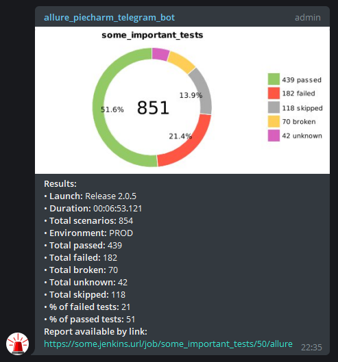
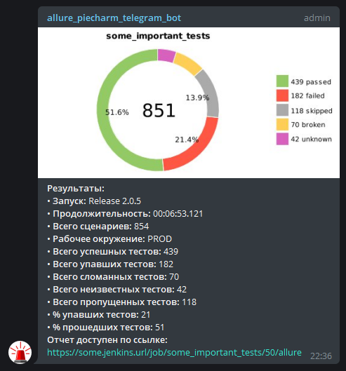
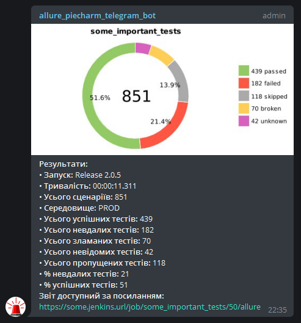
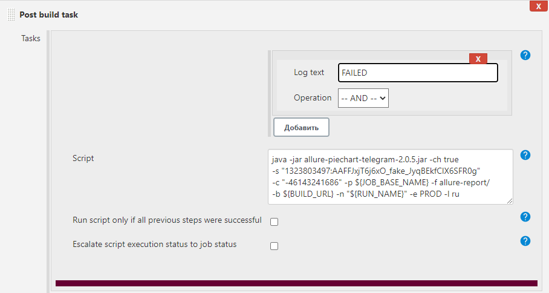

## Allure notifications script
* Telegram
* Slack
* Mattermost
* TODO Email, Skype.

Jar file, that create piechart from results `allure-report/widgets/summary.json` and sends it with link to build to messenger you choose.  

Supports 3 languages. English, Russian, Ukrainian.  

### Telegram config:
0. Create telegram bot in @BotFather and add it to your telegram chat. 
Remember <b>telegram bot secret</b> 
Remember <b>telegram chat id</b>, you can find here -> https://api.telegram.org/bot{telegram_bot_secret}/getUpdates (bot needs admin rights) 
1. You can download ready jar https://github.com/qa-guru/allure-notifications/releases or clone project and build .jar yourself:  
`gradle jar` -> build/libs/allure-notifications-*.jar  
2. Put allure-notifications-*.jar in your in root folder of your autotests project (yes, its awful, but kiss).  
3. Run it after allure-report is generated, 
for example Jenkins postbuild task (Post build plugin required https://plugins.jenkins.io/postbuild-task/):  
`java -jar allure-notifications-2.0.5.jar -ch true -s telegram_bot_secret -c telegram_chat_id -p ${JOB_BASE_NAME} -f allure-report/ -b ${BUILD_URL} -n "Allure piechart telegram bot Release 2.0" -e https://qa.guru -l ru`  

<h3>CommandLine options</h3>

You can run bot using cmd options:  
<table>
    <thead>
        <tr>
            <th>Telegram</th><th>Slack</th><th>Email</th>
        </tr>
    </thead>
    <tbody>
        <tr>
            <td>Create telegram bot</td><td>Create slack app</td><td></td>
        </tr>
        <tr>
            <td>Add telegram bot to chat</td><td>Add app to slack channel</td><td></td>
        </tr>
        <tr>
            <td colspan="3">Configure step in build server</td>
        </tr>
    </tbody>
</table>

All keys should be used with `-D`:   
`build.launch.name - Set build launch name`  
`build.env - Set build environment`  
`build.report.link - Set build report link`  
`lang - Set language (possible values are: ru, en, ua)`  
`enable.chart - Enable/disable PieChart diagram (false by default)`  
`bot.token - Set bot secret token`  
`chat.id - Set chat id`  
`project.name - Set project name`  
`allure.report.folder - Set allure report folder`  
`messenger - Set target messenger (possible values are: telegram, slack, mattermost)`  
`mattermost.api.url - Set mattermost api url`  
Pay attention, all options (except `enable.chart` and `messenger`) are required. Telegram is a default messenger.

Slack configure is in progress!
