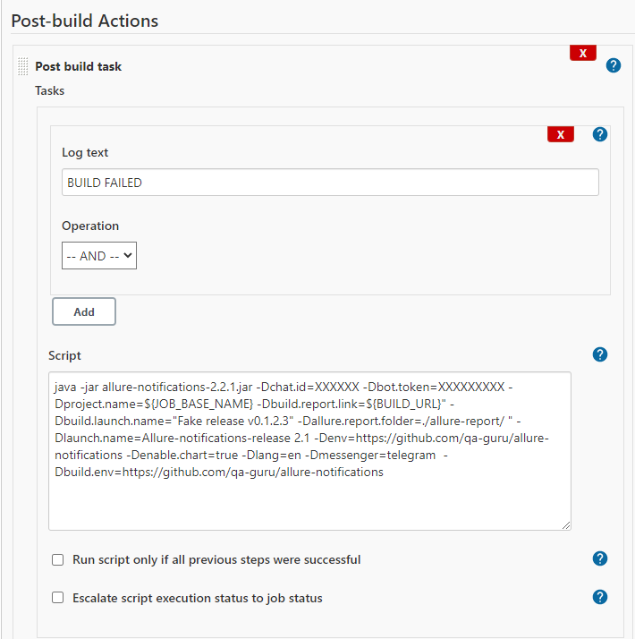

<h1>:bomb: Allure notifications :sun_with_face:</h1>
<h4>for telegram, slack, email, mattermost</h4>

Just put <b>allure-notifications.jar</b> in your project root and it will draw <u>piechart.png</u> (from `allure-report/widgets/summary.json`) and send it to any messenger!<br/>
<h5>Languages: en, ru, ua </h5>

| Telegram | Slack |
:-------------------------:|:-------------------------:
 | 


<h6>Telegram config</h6>

0. Create telegram bot in @BotFather and add it to your telegram chat (with admin permissions).<br/>
Remember <b>telegram bot secret</b><br/>
Remember <b>telegram chat id</b>, you can find here -> https://api.telegram.org/bot{telegram_bot_secret}/getUpdates (bot needs admin rights)<br/>
1. Download latest release https://github.com/qa-guru/allure-notifications/releases or build .jar yourself: <br/>
`gradle jar` -> build/libs/allure-notifications-*.jar <br/>
2. Put allure-notifications-*.jar in your in your autotests project root (sorry, but kiss). <br/>
3. Run it after allure-report is generated, 
for example Jenkins postbuild task (Post build plugin required https://plugins.jenkins.io/postbuild-task/): <br/>



```
java  \
"-Dmessenger=${MESSENGER}" \
"-Dchat.id=${CHAT}" \
"-Dbot.token=${SECRET}" \
"-Dmail.host=${SMTP_SERVER}" \
"-Dmail.port=${SMTP_PORT}" \
"-Dmail.username=${EMAIL_USER}" \
"-Dmail.password=${EMAIL_PASSWORD}" \
"-Dmail.to=${EMAIL}" \
"-Dproject.name=${JOB_BASE_NAME}" \
"-Dbuild.launch.name=${SOME_LAUNCH_NAME}" \
"-Dbuild.env=${ENVIRONMENT}" \
"-Dbuild.report.link=${BUILD_URL}" \
"-Dlang=${LANGUAGE}" \
"-Denable.chart=${CHART}" \
"-Dallure.report.folder=./allure-report/" \
-jar allure-notifications-2.2.1.jar
```

- [x] Telegram config
- [ ] Slack config
- [ ] Email config

<h6>CommandLine options</h6>
All keys should be used with `-D`: <br/> 

| key | telegram | slack | email | mattermost | description |
:----:|:--------:|:-----:|:-----:|:----------:|:------------:
messenger            | :heavy_check_mark: | :heavy_check_mark: | :heavy_check_mark: | :heavy_check_mark: | telegram (default), slack, email, mattermost 
bot.token            | :heavy_check_mark: | :heavy_check_mark: | :x:                | :heavy_check_mark: | Bot/app secret token
chat.id              | :heavy_check_mark: | :heavy_check_mark: | :x:                | :heavy_check_mark: | Chat/channel id
mail.host            | :x:                | :x:                | :heavy_check_mark: | :x:                | Smtp server
mail.port            | :x:                | :x:                | :heavy_check_mark: | :x:                | Smtp port
mail.username        | :x:                | :x:                | :heavy_check_mark: | :x:                | From email username
mail.password        | :x:                | :x:                | :heavy_check_mark: | :x:                | From email password
mail.to              | :x:                | :x:                | :heavy_check_mark: | :x:                | To email list - a@a.a, b@b.b
mattermost.api.url   | :x:                | :x:                | :x:                | :heavy_check_mark: | Mattermost api url
project.name         | :heavy_check_mark: | :heavy_check_mark: | :heavy_check_mark: | :heavy_check_mark: | Project name
build.launch.name    | :heavy_check_mark: | :heavy_check_mark: | :heavy_check_mark: | :heavy_check_mark: | Build launch name
build.env            | :heavy_check_mark: | :heavy_check_mark: | :heavy_check_mark: | :heavy_check_mark: | Build environment
build.report.link    | :heavy_check_mark: | :heavy_check_mark: | :heavy_check_mark: | :heavy_check_mark: | Build report link
lang                 | :heavy_check_mark: | :heavy_check_mark: | :heavy_check_mark: | :heavy_check_mark: | Supported languages: en, fr, ru, ua
enable.chart         | :heavy_check_mark: | :heavy_check_mark: | :heavy_check_mark: | :heavy_check_mark: | Enable/disable PieChart diagram (false by default)
allure.report.folder | :heavy_check_mark: | :heavy_check_mark: | :heavy_check_mark: | :heavy_check_mark: | Set allure report folder
