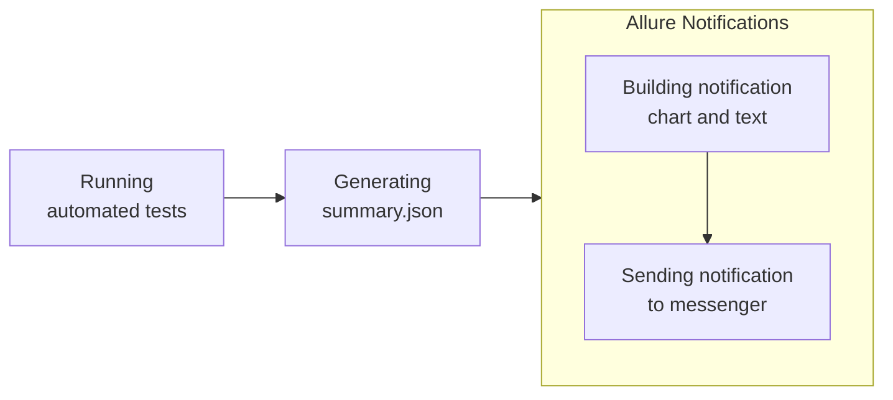
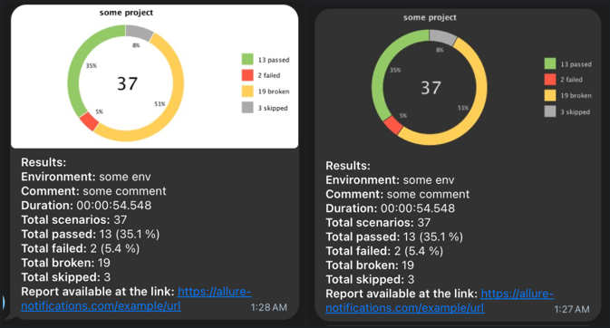

[](#) [](README.ru.md) [](README.fr.md)

# Allure notifications
**Allure notifications** is a library that sends automatic notifications about automated test results to your preferred messenger (Telegram, Slack, ~~Skype~~, Email, Mattermost, Discord, Loop, Rocket.Chat, Zoho Cliq, Microsoft Teams).

Notification languages: 🇬🇧 🇫🇷 🇷🇺 🇺🇦 🇧🇾 🇨🇳

## Table of contents
+ [How it works](#how-it-works)
+ [What the notifications look like](#what-the-notifications-look-like)
+ [How to use in your project](#how-to-use-in-your-project)
  + [Running locally](#running-locally)
  + [Running from Jenkins](#running-from-jenkins)
+ [Messenger-specific config.json settings](#messenger-specific-configjson-settings)


## How it works
After automated tests finish, a `summary.json` file is generated in the `allure-report/widgets` folder. This file contains general test result statistics, which the library uses to build the notification (drawing a chart and adding the corresponding text).


```mermaid
flowchart LR
    A[Running\nautomated tests] --> B[Generating\nsummary.json]
    B --> C
    subgraph C[Allure Notifications]
        D[Building notification\nchart and text] --> E[Sending notification\nto messenger]
    end
```

Example `summary.json`:
```json
{
  "reportName" : "Allure Report",
  "testRuns" : [ ],
  "statistic" : {
    "failed" : 182,
    "broken" : 70,
    "skipped" : 118,
    "passed" : 439,
    "unknown" : 42,
    "total" : 851
  },
  "time" : {
    "start" : 1590795193703,
    "stop" : 1590932641296,
    "duration" : 11311,
    "minDuration" : 7901,
    "maxDuration" : 109870,
    "sumDuration" : 150125
  }
}
```
If the Allure Summary plugin is connected, a `suites.json` file will also be generated and its data will be included in the statistics.


## What the notifications look like
Example notification in Telegram




## How to use in your project

### Running locally
1. Install Java (not required when running from Jenkins).
2. Create a `notifications` folder in the root of your project.
3. [Download](https://github.com/qa-guru/allure-notifications/releases) the latest `allure-notifications-<version>.jar` and place it in the `notifications` folder.
4. Inside `notifications`, create a `config.json` file with the following structure (keep the `base` section and only the messenger block you need):
```json
{
  "base": {
    "logo": "",
    "project": "",
    "environment": "",
    "comment": "",
    "reportLink": "",
    "language": "en",
    "allureFolder": "",
    "enableChart": false,
    "darkMode": false,
    "enableSuitesPublishing": false,
    "customData": {}
  },
  "telegram": {
    "token": "",
    "chat": "",
    "topic": "",
    "replyTo": "",
    "templatePath": "/templates/telegram.ftl"
  },
  "slack": {
    "token": "",
    "chat": "",
    "replyTo": "",
    "templatePath": "/templates/markdown.ftl"
  },
  "mattermost": {
    "url": "",
    "token": "",
    "chat": "",
    "templatePath": "/templates/markdown.ftl"
  },
  "rocketChat" : {
    "url": "",
    "auth_token": "",
    "user_id": "",
    "channel": "",
    "templatePath": "/templates/rocket.ftl"
  },
  "mail": {
    "host": "",
    "port": "",
    "username": "",
    "password": "",
    "securityProtocol": null,
    "from": "",
    "to": "",
    "cc": "",
    "bcc": "",
    "templatePath": "/templates/html.ftl"
  },
  "discord": {
    "botToken": "",
    "channelId": "",
    "templatePath": "/templates/markdown.ftl"
  },
  "loop": {
    "webhookUrl": "",
    "templatePath": "/templates/markdown.ftl"
  },
  "cliq": {
    "token": "",
    "chat": "",
    "bot": "",
    "dataCenter": "eu",
    "templatePath": "/templates/markdown.ftl"
  },
  "teams": {
    "webhookUrl": "",
    "templatePath": "/templates/teams.ftl"
  },
  "proxy": {
    "host": "",
    "port": 0,
    "username": "",
    "password": ""
  }
}
```
The `proxy` block is used to specify additional proxy configuration.  
The `templatePath` parameter is optional and allows you to provide a path to a custom Freemarker template. Example:
```json
{
  "base": { "..." : "..." },
  "mail": {
    "host": "smtp.gmail.com",
    "port": "465",
    "username": "username",
    "password": "password",
    "securityProtocol": "SSL",
    "from": "test@gmail.com",
    "to": "test1@gmail.com",
    "cc": "testCC1@gmail.com, testCC2@gmail.com",
    "bcc": "testBCC1@gmail.com, testBCC2@gmail.com",
    "templatePath": "/templates/html_custom.ftl"
  }
}
```

5. Fill in the `base` block:
```json
"base": {
    "project": "some project",
    "environment": "some env",
    "comment": "some comment",
    "reportLink": "",
    "language": "en",
    "allureFolder": "build/allure-report/",
    "enableChart": true,
    "darkMode": true,
    "enableSuitesPublishing": true,
    "logo": "logo.png",
    "durationFormat": "HH:mm:ss.SSS",
    "customData": {
      "variable1": "value1",
      "variable2": "value2"
    }
}
```
Fields:
+ `project`, `environment`, `comment` — project name, environment name, and an arbitrary comment.
+ `reportLink` — link to the Allure report with test results (useful when running from Jenkins).
+ `language` — notification language (`en` / `fr` / `ru` / `ua` / `by` / `cn`).
+ `allureFolder` — path to the folder containing Allure results.
+ `enableChart` — whether to display the chart (`true` / `false`).
+ `darkMode` — whether to render the chart in dark mode (`true` / `false`).
+ `enableSuitesPublishing` — whether to publish per-suite statistics (`true` / `false`, default `false`). Requires `suites.json` inside `<allureFolder>/widgets`.
+ `logo` — path to a logo file; if set, the logo is displayed in the top-left corner of the chart.
+ `durationFormat` (optional, default `HH:mm:ss.SSS`) — output format for test duration.
+ `customData` — extra key-value data available in custom Freemarker templates (optional).

6. Fill in the messenger block: see [Messenger-specific config.json settings](#messenger-specific-configjson-settings).

7. Run the following command in your terminal:
```shell
java "-DconfigFile=notifications/config.json" -jar notifications/allure-notifications-4.11.0.jar
```
Notes:
+ `summary.json` must already be generated before running this command.
+ Replace the jar version with the one you downloaded.
+ Settings can be overridden via system properties (system properties take precedence over `config.json`):
```shell
java "-DconfigFile=notifications/config.json" \
  "-Dnotifications.base.environment=${STAND}" \
  "-Dnotifications.base.reportLink=${ALLURE_SERVICE_URL}" \
  "-Dnotifications.base.project=${PROJECT_ID}" \
  "-Dnotifications.telegram.token=${TG_BOT_TOKEN}" \
  "-Dnotifications.telegram.chat=${TG_CHAT_ID}" \
  "-Dnotifications.telegram.topic=${TG_CHAT_TOPIC_ID}" \
  -jar allure-notifications.jar
```
ℹ️ Custom data property prefixes are stripped: `-Dbase.customData.variable1=someValue` becomes the key `variable1` with value `someValue`.  
⚠️ Using `base.customData.` without a trailing name is also valid.


### Running from Jenkins
1. Open the build configuration in Jenkins.
2. Under **Build**, click **Add build step** and choose **Create/Update Text File**.


Fill it in as shown below:


Notes:
+ General `base` block settings are described [above](#5-fill-in-the-base-block).
+ Use Jenkins variables as values: `"project": "${JOB_BASE_NAME}"` and `"reportLink": "${BUILD_URL}"`.
+ Messenger-specific settings are described in the [next section](#messenger-specific-configjson-settings).

3. Under **Post-build Actions**, click **Add post-build action** → **Post build task**.


In the **Script** field, enter:
```bash
cd ..
FILE=allure-notifications-4.11.0.jar
if [ ! -f "$FILE" ]; then
   wget https://github.com/qa-guru/allure-notifications/releases/download/4.11.0/allure-notifications-4.11.0.jar
fi
```
Click **Add another task** and in the second **Script** field enter:
```bash
java "-DconfigFile=notifications/config.json" -jar ../allure-notifications-4.11.0.jar
```

4. Save the configuration and run your tests. A notification will be sent to the configured messenger upon completion.


## Messenger-specific config.json settings
+ <a href="https://github.com/qa-guru/knowledge-base/wiki/12.-Телеграм-бот.-Отправляем-уведомления-о-результатах-прохождения-тестов" target="_blank">Telegram config</a>
  + `telegram` block parameters:
    <ul>
      <li><code>topic</code> — optional; unique identifier of the target message thread (topic) of the chat to send the message to. See <a href="https://stackoverflow.com/questions/74773675/how-to-get-topic-id-for-telegram-group-chat">Stackoverflow answers</a> for how to get this value.</li>
    </ul>
+ <a href="https://github.com/qa-guru/allure-notifications/wiki/Slack-configuration" target="_blank">Slack config</a>
+ <a href="https://github.com/qa-guru/allure-notifications/wiki/Email-configuration" target="_blank">Email config</a>
+ <a href="https://github.com/qa-guru/allure-notifications/wiki/Mattermost-configuration" target="_blank">Mattermost config</a>
+ <details>
    <summary>Discord config</summary>
    To enable Discord notifications provide 2 parameters: <code>botToken</code> and <code>channelId</code>.
    <ul>
      <li>To create a Discord bot and get its token:
        <ol>
          <li>Enable "Developer mode" in your Discord account.</li>
          <li>Open the Discord API developer portal and click "Applications".</li>
          <li>Click "New Application", name it, and click "Create".</li>
          <li>Go to "Bot" and generate a token with "Add Bot".</li>
          <li>Copy the token and paste it into the JSON config.</li>
          <li>Under "OAuth2", activate "bot", set permissions, and copy the invite URL to add the bot to your server.</li>
        </ol>
      </li>
      <li>To get a Channel ID: right-click the channel and click "Copy ID", then paste it into the JSON config.</li>
    </ul>
  </details>
+ <details>
    <summary>Loop config</summary>
    To create a Loop webhook URL:
    <ul>
      <li>Open the main menu of the Loop application.</li>
      <li>Click "Integrations" → "Incoming Webhooks".</li>
      <li>Click "Add Incoming Webhook", fill in the form, select a channel, and click "Save".</li>
      <li>Copy the generated webhook URL into the JSON config.</li>
    </ul>
  </details>
+ <details>
    <summary>Rocket.Chat config</summary>
    Required parameters: <code>url</code>, <code>auth_token</code>, <code>user_id</code>, <code>channel</code>.
    <ol>
      <li>Generate an <code>auth_token</code> from your user settings — this also provides the <code>user_id</code>.</li>
      <li>Retrieve the channel name using the generated tokens via the <a href="https://developer.rocket.chat/reference/api/rest-api/endpoints/rooms/channels-endpoints/info" target="_blank">Rocket.Chat REST API</a>.</li>
    </ol>
  </details>
+ <details>
    <summary>Zoho Cliq config</summary>
    Required parameters:
    <ul>
      <li><code>token</code> — your Zoho Cliq API token (zapikey). To obtain it:
        <ol>
          <li>Go to your Zoho Cliq account settings.</li>
          <li>Navigate to "Bots &amp; Tools" → "Bot".</li>
          <li>Create a new bot or use an existing one.</li>
          <li>Copy the token (zapikey) from the "Webhook URL".</li>
        </ol>
      </li>
      <li><code>chat</code> — the name of the channel to send notifications to.</li>
      <li><code>bot</code> — (optional) unique name of the bot to send messages as.</li>
      <li><code>dataCenter</code> — Zoho data center region:
        <ul>
          <li><code>com</code> — United States (cliq.zoho.com)</li>
          <li><code>eu</code> — Europe (cliq.zoho.eu) — default</li>
          <li><code>in</code> — India (cliq.zoho.in)</li>
          <li><code>au</code> — Australia (cliq.zoho.com.au)</li>
          <li><code>jp</code> — Japan (cliq.zoho.jp)</li>
          <li><code>ca</code> — Canada (cliq.zohocloud.ca)</li>
        </ul>
      </li>
    </ul>
    See the <a href="https://www.zoho.com/cliq/help/restapi/v2/" target="_blank">official Zoho Cliq API documentation</a> for more details.
  </details>
+ <details>
    <summary>Microsoft Teams config</summary>
    Notifications are delivered as an Adaptive Card to a Teams webhook URL generated by the <strong>Workflows</strong> app (Power Automate). Microsoft 365 Connectors (the legacy "Incoming Webhook" connector) are <a href="https://devblogs.microsoft.com/microsoft365dev/retirement-of-office-365-connectors-within-microsoft-teams/" target="_blank">being retired</a> — use Workflows for new integrations.
    <p>The only required parameter is <code>webhookUrl</code>.</p>
    <strong>How to obtain the webhook URL:</strong>
    <ol>
      <li>In Microsoft Teams open the target team and channel.</li>
      <li>Click <strong>More options (…)</strong> next to the channel → <strong>Workflows</strong>.</li>
      <li>Choose the template <em>"Post to a channel when a webhook request is received"</em>.</li>
      <li>Configure the parameters and click <strong>Save</strong>.</li>
      <li>Copy the generated webhook URL and paste it into the <code>teams.webhookUrl</code> field of <code>config.json</code>.</li>
    </ol>
    See the <a href="https://learn.microsoft.com/en-us/microsoftteams/platform/webhooks-and-connectors/how-to/add-incoming-webhook" target="_blank">official Microsoft Teams documentation</a> for more details.
    <p><strong>Notes &amp; limitations</strong> (per Teams docs):</p>
    <ul>
      <li>The chart (when <code>enableChart=true</code>) is embedded into the Adaptive Card as a base64 image, so no external hosting is required.</li>
      <li>Total message payload must be ≤ <strong>28 KB</strong>. Very large charts may need to be disabled or hosted externally.</li>
      <li>Teams throttles webhook requests at <strong>4 requests/second</strong>.</li>
      <li>The Adaptive Card uses <code>$schema</code> <code>http://adaptivecards.io/schemas/adaptive-card.json</code>, version <code>1.5</code>. To customize the card, provide your own template via <code>templatePath</code> — the file content becomes the <code>TextBlock.text</code> field (Teams-flavored Markdown: <code>**bold**</code>, <code>_italic_</code>, lists, links).</li>
    </ul>
  </details>
