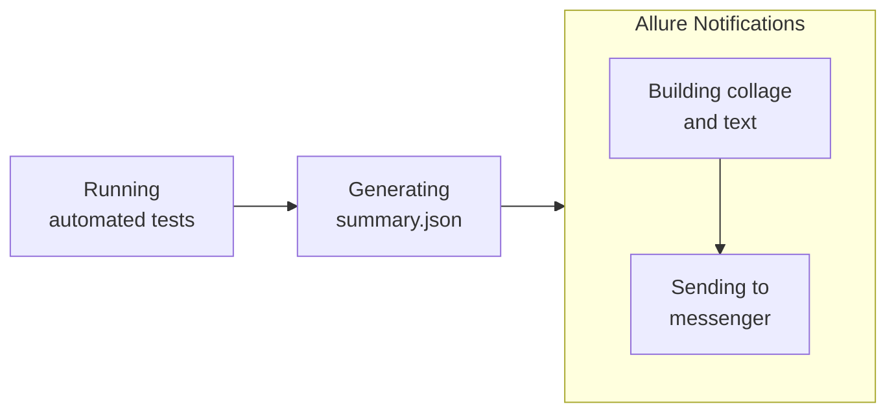

[](#) [](README.ru.md) [](README.fr.md)

# Allure notifications

CLI that turns an Allure report into a messenger notification: text + optional collage PNG.

Messengers: Telegram, Slack, Email, Mattermost, Discord, Loop, Rocket.Chat, Zoho Cliq, Microsoft Teams.  
Languages: 🇬🇧 🇫🇷 🇷🇺 🇺🇦 🇧🇾 🇨🇳

Build `config.json` in the [Config builder](#config-builder), then send with the CLI.

## Table of contents

+ [What's new in 6.0](#whats-new-in-60)
+ [How it works](#how-it-works)
+ [Quick start](#quick-start)
+ [config.json](#configjson)
+ [Config builder](#config-builder)
+ [Visual canon](#visual-canon)
+ [Plugin (alternate)](#plugin-alternate)
+ [Legacy Java 5.0.8](#legacy-java-508)
+ [CI cookbook](#ci-cookbook)

## What's new in 6.0

| Version | Stack | Allure | Status |
|---------|-------|--------|--------|
| **4.\*** | Java | Allure 2 | Historical |
| **5.\*** | Java | Allure 3 | Legacy freeze at **5.0.8** (`legacy/java/`); there is **no 5.1** |
| **6.\*** | TypeScript | Allure 3 | **Product** — pin **6.0.9** (CLI + builder + plugin) |

Older patch notes → [GitHub Releases](https://github.com/qa-guru/allure-notifications/releases) · migration → [`MIGRATION.md`](MIGRATION.md).

| Piece | Role |
|-------|------|
| **CLI** | `npx allure-notifications@6.0.9 send --config …` — primary runtime |
| **Collage PNG** | `@napi-rs/canvas` in `@allure-notifications/core` (Playwright = tests only) |
| **Config builder** | Web UI → full `config.json` + free-layout collage — [`apps/builder/`](apps/builder/) |
| **Packages** | `@allure-notifications/config` · `pyramid` · `core` · bin `allure-notifications` · plugin `@allure-notifications/plugin` |
| **Allure 3 plugin** | Alternate `done` hook — see [Plugin](#plugin-alternate) |

## How it works

After tests finish, Allure writes a summary. The CLI finds it automatically:

- **Allure 2** — `<allureFolder>/widgets/summary.json`
- **Allure 3** — `<allureFolder>/summary.json`

Summary drives notification text. In collage mode the CLI also reads `*-result.json` from `allureResultsFolder` for pyramid, suites, durations, and other panels.


```mermaid
flowchart LR
    A[Running\nautomated tests] --> B[Generating\nsummary.json]
    B --> C
    subgraph C[Allure Notifications]
        D[Building collage\nand text] --> E[Sending to\nmessenger]
    end
```

Example notification (Telegram):


## Quick start

```bash
npx allure generate allure-results --clean -o allure-report
npx allure-notifications@6.0.9 send --config config.json --live
```

| Flag | Behavior |
|------|----------|
| `--dry-run` | Render collage; list messengers that *would* send; **no network** (PR / local without secrets) |
| `--mock` | Render collage; mock deliveries; **no network** |
| `--live` | Actually send (Telegram when credentials are set) |
| `--out <png>` | Write collage PNG to disk |

Default without `--live` / `--mock` is safe **dry-run**.

## config.json

Schema: [`packages/config`](packages/config) (zod). Prefer Export from the [Config builder](#config-builder).

Minimal **6.0** example — collage + free layout + one messenger:

```json
{
  "base": {
    "project": "my-project",
    "environment": "ci",
    "comment": "",
    "language": "en",
    "allureFolder": "allure-report/",
    "allureResultsFolder": "allure-results/",
    "enableChart": true,
    "darkMode": true,
    "chart": {
      "mode": "collage",
      "layout": "free",
      "width": 870,
      "height": 1080,
      "headerHeight": 22,
      "cardGap": 14,
      "tilePad": 6,
      "gridCols": 10,
      "gridRows": 10,
      "items": [
        { "type": "pie", "x": 0, "y": 0, "w": 4, "h": 4 },
        { "type": "durationDynamics", "x": 4, "y": 0, "w": 6, "h": 4 },
        { "type": "testingPyramid", "x": 0, "y": 4, "w": 3, "h": 3 },
        { "type": "durations", "x": 3, "y": 4, "w": 4, "h": 3, "groupBy": "layer" }
      ],
      "pyramidFallback": "suites"
    },
    "links": {
      "report": "${ALLURE_REPORT_URL}",
      "dashboard": "${ALLURE_DASHBOARD_URL}",
      "testops": "",
      "build": "${BUILD_URL}"
    }
  },
  "telegram": {
    "token": "${TELEGRAM_BOT_TOKEN}",
    "chat": "${TELEGRAM_CHAT_ID}",
    "topic": "",
    "templatePath": "/templates/telegram.ftl"
  }
}
```

### `base` fields

| Field | Notes |
|-------|--------|
| `project`, `environment`, `comment` | Shown in notification text |
| `links` | `report`, `dashboard`, `testops`, `build` — only non-empty links appear |
| `reportLink` | **Deprecated** — use `links.report` (still accepted as fallback) |
| `language` | `en` / `fr` / `ru` / `ua` / `by` / `cn` / `cnt` |
| `allureFolder` | Generated Allure report directory |
| `allureResultsFolder` | Raw `allure-results` (needed for collage analytics) |
| `enableChart` | Attach collage / chart image |
| `chart.mode` | `collage` (primary) or `pie` |
| `chart.layout` | **`free` + `items`** is the main path. Legacy `grid` \| `stacked` \| `row` still supported |
| `chart.width` / `height` | Canvas size (px) |
| `chart.headerHeight` / `cardGap` / `tilePad` | Card chrome (builder defaults: 22 / 14 / 6) |
| `darkMode` | Chart theme |
| `enableSuitesPublishing` | Per-suite stats from `suites.json` when present |
| `logo`, `durationFormat`, `customData` | Optional |

### Messengers

Keep `base` and only the messenger block you need. Optional `templatePath` points to a custom Freemarker template.

**Telegram** — [wiki](https://github.com/qa-guru/knowledge-base/wiki/12.-Телеграм-бот.-Отправляем-уведомления-о-результатах-прохождения-тестов): `token`, `chat`, optional `topic` / `replyTo`.

**Slack** — [wiki](https://github.com/qa-guru/allure-notifications/wiki/Slack-configuration): `token`, `chat`, optional `replyTo`.

**Email** — [wiki](https://github.com/qa-guru/allure-notifications/wiki/Email-configuration): `host`, `port`, `username`, `password`, `from`, `to`, optional `cc` / `bcc` / `securityProtocol`.

**Mattermost** — [wiki](https://github.com/qa-guru/allure-notifications/wiki/Mattermost-configuration): `url`, `token`, `chat`.

<details>
<summary>Discord</summary>

`botToken`, `channelId`. Enable Developer mode → Discord developer portal → Applications → Bot token; right-click channel → Copy ID.
</details>

<details>
<summary>Loop</summary>

`webhookUrl` — Integrations → Incoming Webhooks → create webhook for the channel.
</details>

<details>
<summary>Rocket.Chat</summary>

`url`, `auth_token`, `user_id`, `channel`. Generate token in user settings (also yields `user_id`).
</details>

<details>
<summary>Zoho Cliq</summary>

`token` (zapikey), `chat`, optional `bot`, `dataCenter` (`com` / `eu` / `in` / `au` / `jp` / `ca`; default `eu`).
</details>

<details>
<summary>Microsoft Teams</summary>

`webhookUrl` from the Workflows app template *“Post to a channel when a webhook request is received”* (legacy Office 365 Connectors are retiring). Chart embeds as base64; payload ≤ 28 KB; ~4 req/s throttle.
</details>

Optional top-level `proxy` (`type`: `http` \| `socks5`, `host`, `port`, …) for outbound HTTP/SOCKS where supported.

## Config builder

Web UI that exports a full `config.json` (`base` · `chart` · `links` · messengers) with a free-layout collage editor.

| | |
|--|--|
| **Prod** | [allure-notifications.qa.guru](https://allure-notifications.qa.guru/) |
| **Project Pages** | [qa-guru.github.io/allure-notifications](https://qa-guru.github.io/allure-notifications/) |
| **Source** | [`apps/builder/`](apps/builder/) |
| **Canon** | [`apps/builder/CANON.md`](apps/builder/CANON.md) |

### Canvas presets

| Preset | Size | Notes |
|--------|------|--------|
| **SQ-1080** | 1080×1080 | Dense 12-tile default square canvas |
| **CB-870** | 870×1080 | Telegram-oriented editor canvas (post cap 1024×1280) |
| **WD-1410** | 1410×1080 | Wide canvas |

### Export → CLI

1. Arrange panels in the builder → **Export** / Download `config.json`.
2. Point `base.allureFolder` / `base.allureResultsFolder` at your report and results.
3. Fill messenger credentials (or env placeholders).
4. Send:

```bash
npx allure-notifications@6.0.9 send --config <exported>.json
```

### Local stand (monorepo)

```bash
python scripts/stands/ensure.py anb-apps-builder
```

Opens the static builder at [http://localhost:3011/](http://localhost:3011/).

### Collage preview


## Visual canon

Locked collage rules and reference PNG: [`docs/canon/CANON.md`](docs/canon/CANON.md).

## Plugin (alternate)

Allure 3 plugin — thin wrapper over the same core pipeline. CLI remains primary.

```bash
npm add allure @allure-notifications/plugin@6.0.9
```

- Docs: [`packages/plugin/README.md`](packages/plugin/README.md)
- Example: [`examples/allurerc.notifications.mjs`](examples/allurerc.notifications.mjs)
- GitHub Actions sample: [`examples/github-actions/`](examples/github-actions/)

## Legacy Java 5.0.8

Bugfix / security only. Build: [`legacy/java/`](legacy/java/).

```bash
java -DconfigFile=notifications/config.json -jar allure-notifications-5.0.8.jar
```

Release: [v5.0.8](https://github.com/qa-guru/allure-notifications/releases/tag/v5.0.8) · 4.x → 5.0 notes: [`docs/migration-5.0.md`](docs/migration-5.0.md).

## CI cookbook

[`docs/ci-cookbook.md`](docs/ci-cookbook.md) · jar-era notes: [`docs/ci-cookbook-5.0.md`](docs/ci-cookbook-5.0.md).
