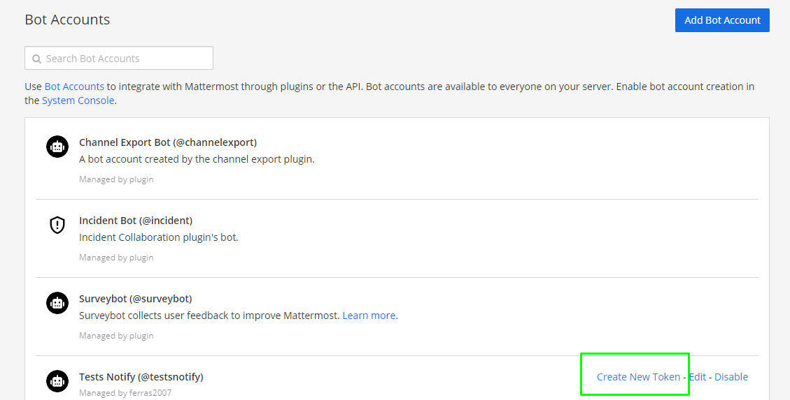
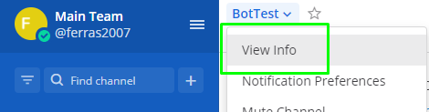
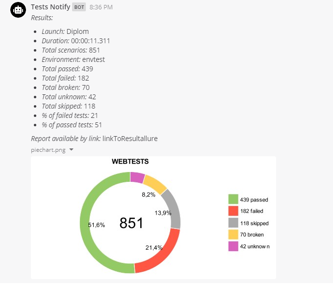

<h3>Allure notifications script</h3>
for telegram, slack, email (//todo)

jar, that draws piechart from results `allure-report/widgets/summary.json` and sends it with link to build to telegram-chat / slack / mattermost / email (//todo)

<h3>Telegram config:</h3>
0. Create telegram bot in @BotFather and add it to your telegram chat. 
Remember <b>telegram bot secret</b> 
Remember <b>telegram chat id</b>, you can find here -> https://api.telegram.org/bot{telegram_bot_secret}/getUpdates (bot needs admin rights) 
1. You can download ready jar https://github.com/qa-guru/allure-notifications/releases or clone project and build .jar yourself:  
`gradle jar` -> build/libs/allure-notifications-*.jar  
2. Put allure-notifications-*.jar in your in root folder of your autotests project (yes, its awful, but kiss).  
3. Run it after allure-report is generated, 
for example Jenkins postbuild task (Post build plugin required https://plugins.jenkins.io/postbuild-task/):  
`java -jar allure-notifications-2.0.5.jar -ch true -s telegram_bot_secret -c telegram_chat_id -p ${JOB_BASE_NAME} -f allure-report/ -b ${BUILD_URL} -n "Allure piechart telegram bot Release 2.0" -e https://qa.guru -l ru`  

<h3>Mattermost config:</h3>
0.Create mattermost bot in your team and get access token

1.Get channel id when you want to get notifications 
 

2.Add mattermost server url to command line option 
example `-u notifytest.cloud.mattermost.com` and set messenger `-m mattermost` 

3.Final result 

<h3>CommandLine options</h3>

You can run bot using cmd options:  
`-ch, --chart - Enable/disable PieChart diagram (false by default);`  
`-s, --secret, --token - Set telegram bot secret token;`  
`-c, --chat, --id - Set telegram chat id;`  
`-p, --project - Set project name;`  
`-f, --folder, --allure - Set allure report folder;`  
`-b, --build, --link - Set link to build;`  
`-n, --name - Set launch name;`  
`-e, --env - Set environment;`  
`-l, --lang - Set template language (possible values are: ru, en, ua). English by default.`  
`-u, --mmUrl - Set mattermost server Url;`  
Pay attention, all options (except `-ch` and `-l`) are required.

Slack configure is in progress!
