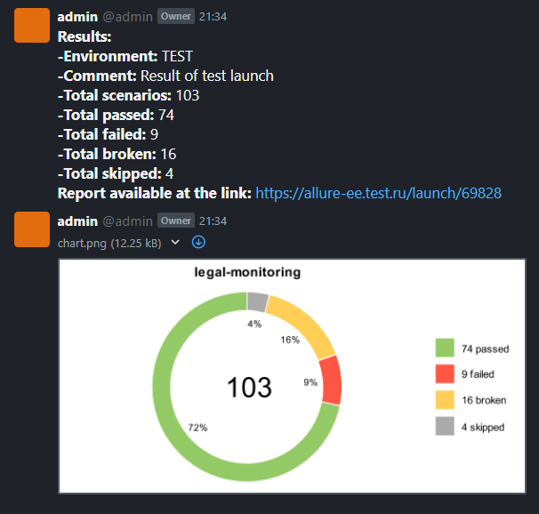
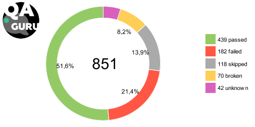

<h1>Allure notifications :sun_with_face:</h1>
<h6>for telegram, slack, skype, email, mattermost, rocket</h6>

<h3>Languages: :uk: :fr: :ru: :ukraine: :belarus: :cn:</h3>

| Telegram | Slack |
:-------------------------:|:-------------------------:
 | 
| **Mattermost** | **Email** |
 | 
| **RocketChat** |
 |
| **Skype** | **Icq**  |
| Done | Wat? lol |


<h6>How to:</h6>

- [x] [Telegram config](https://github.com/qa-guru/allure-notifications/wiki/Telegram-configuration)
- [x] [Slack config](https://github.com/qa-guru/allure-notifications/wiki/Slack-configuration)
- [x] [Email config](https://github.com/qa-guru/allure-notifications/wiki/Email-configuration)
- [x] [Skype config](https://github.com/qa-guru/allure-notifications/wiki/Skype-configuration)
- [x] [Mattermost config](https://github.com/qa-guru/allure-notifications/wiki/Mattermost-configuration)
- [x] [Rocket config]


<h6>CommandLine options</h6>
All keys should be used with `-D`: <br/>

| key | description |
|:---:| :---------: |
| configFile | Path to JSON-config file |

```
java \
"-DconfigFile=${PATH_TO_FILE}" \
-jar allure-notifications-4.1.jar
```

If you want the project logo to appear in the upper left corner of the chart,
add the file logo.png to root of project


<h6>Config file structure</h6>
Here you can find config file structure for lib configuration.

```json
{
  "base": {
    "logo": "",
    "project": "",
    "environment": "",
    "comment": "",
    "reportLink": "",
    "language": "ru",
    "allureFolder": "",
    "enableChart": false
  },
  "telegram": {
    "token": "",
    "chat": "",
    "replyTo": ""
  },
  "slack": {
    "token": "",
    "chat": "",
    "replyTo": ""
  },
  "mattermost": {
    "url": "",
    "token": "",
    "chat": ""
  },
   "rocket" : {
      "url": "",
      "auth_token": "",
      "user_id": "",
      "channel": ""
   },
  "skype": {
    "appId": "",
    "appSecret": "",
    "serviceUrl": "",
    "conversationId": "",
    "botId": "",
    "botName": ""
  },
  "mail": {
    "host": "",
    "port": "",
    "username": "",
    "password": "",
    "securityProtocol": null,
    "from": "",
    "recipient": ""
  },
   "testOps": {
      "url": "",
      "auth_token": "",
      "xsrf_token": "",
      "project_id": ""
   },
  "proxy": {
    "host": "",
    "port": 0,
    "username": "",
    "password": ""
  }
}
```
You only need:
 - to fill needed options in `base` block (please, be careful, `language` field is required!);
 - to configure desired destinations for notifications (`telegram`, `slack`,  `mattermost`, `skype`, `mail`), keep in mind it's possible to set multiple destinations at once, if no destination is set, then no notification will be sent and no error will occur;
 - to specify optional proxy configuration in `proxy` block.
 - if you need Allure TestOps integration, you must fill field `enableTestOpsIntegration` in `base` block and fill `testOps` block

If you want the project logo to appear in the upper left corner of the chart,
add file path to logo parameter in configuration



Example for Telegram messenger:
```json
{
  "base": {
    "project": "some project",
    "environment": "some env",
    "comment": "some comment",
    "reportLink": "",
    "language": "en",
    "allureFolder": "build/allure-report/",
    "enableChart": true
  },
  "telegram": {
    "token": "asdhsdgfjsdfgFgjhg4831)@",
    "chat": "-1",
    "replyTo": ""
  }
}
```

<h6>Email client configuration</h6>

 - `host` - the SMTP server to connect to.
 - `port` - the SMTP server port to connect to.
 - `username` - user to authenticate to the SMTP server.
 - `password` - user's password for authentication.
 - `securityProtocol` (optional: can be omitted or set to `null`) - one of the following security protocols:
   - `SSL` - use SSL to connect (make sure the SSL port is used).
   - `STARTTLS` - use of the STARTTLS command (if supported by the server) to switch the connection to
   a TLS-protected connection before issuing any login commands. If the server does not support STARTTLS,
   the connection continues without the use of TLS.
 - `from` - email address to use for SMTP MAIL command, this sets the envelope return address.
 - `recipient` - comma-separated list of recipient email addresses.
