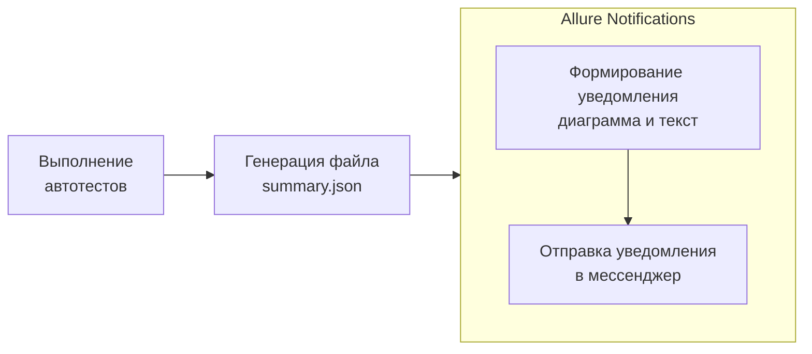

[](README.md) [](#) [](README.fr.md)

# Allure notifications
**Allure notifications** — это библиотека, позволяющая выполнять автоматическое оповещение о результатах прохождения автотестов, которое направляется в нужный вам мессенджер (Telegram, Slack, ~~Skype~~, Email, Mattermost, Discord, Loop, Rocket.Chat, Zoho Cliq).

Языки оповещений: 🇬🇧 🇫🇷 🇷🇺 🇺🇦 🇧🇾 🇨🇳

## Содержание
+ [Принцип работы](#принцип-работы)
+ [Как выглядят оповещения](#как-выглядят-оповещения)
+ [Как использовать в своём проекте](#как-использовать-в-своём-проекте)
  + [Для запуска локально](#для-запуска-локально)
  + [Для запуска из Jenkins](#для-запуска-из-jenkins)
+ [Особенности заполнения config.json в зависимости от мессенджера](#особенности-заполнения-configjson-в-зависимости-от-мессенджера)


## Принцип работы
По итогам выполнения автотестов генерируется файл `summary.json` в папке `allure-report/widgets`. Этот файл содержит общую статистику о результатах прохождения тестов, на основании которой формируется уведомление (отрисовывается диаграмма и добавляется соответствующий текст).



Пример файла `summary.json`:
```json
{
  "reportName" : "Allure Report",
  "testRuns" : [ ],
  "statistic" : {
    "failed" : 182,
    "broken" : 70,
    "skipped" : 118,
    "passed" : 439,
    "unknown" : 42,
    "total" : 851
  },
  "time" : {
    "start" : 1590795193703,
    "stop" : 1590932641296,
    "duration" : 11311,
    "minDuration" : 7901,
    "maxDuration" : 109870,
    "sumDuration" : 150125
  }
}
```
Кроме этого, если подключён Allure Summary плагин, также будет сгенерирован файл `suites.json`, данные из которого тоже будут включены в статистику.


## Как выглядят оповещения
Пример оповещения в Telegram


## Как использовать в своём проекте

### Для запуска локально
1. Установить Java (для запуска из Jenkins не требуется).
2. Создать в корне проекта папку `notifications`.
3. [Скачать](https://github.com/qa-guru/allure-notifications/releases) актуальную версию файла `allure-notifications-<version>.jar` и разместить его в папке `notifications`.
4. В папке `notifications` создать файл `config.json` со следующей структурой (оставить раздел `base` и тот мессенджер, на который требуется отправлять оповещения):
```json
{
  "base": {
    "logo": "",
    "project": "",
    "environment": "",
    "comment": "",
    "reportLink": "",
    "language": "ru",
    "allureFolder": "",
    "enableChart": false,
    "darkMode": false,
    "enableSuitesPublishing": false,
    "customData": {}
  },
  "telegram": {
    "token": "",
    "chat": "",
    "topic": "",
    "replyTo": "",
    "templatePath": "/templates/telegram.ftl"
  },
  "slack": {
    "token": "",
    "chat": "",
    "replyTo": "",
    "templatePath": "/templates/markdown.ftl"
  },
  "mattermost": {
    "url": "",
    "token": "",
    "chat": "",
    "templatePath": "/templates/markdown.ftl"
  },
  "rocketChat" : {
    "url": "",
    "auth_token": "",
    "user_id": "",
    "channel": "",
    "templatePath": "/templates/rocket.ftl"
  },
  "mail": {
    "host": "",
    "port": "",
    "username": "",
    "password": "",
    "securityProtocol": null,
    "from": "",
    "to": "",
    "cc": "",
    "bcc": "",
    "templatePath": "/templates/html.ftl"
  },
  "discord": {
    "botToken": "",
    "channelId": "",
    "templatePath": "/templates/markdown.ftl"
  },
  "loop": {
    "webhookUrl": "",
    "templatePath": "/templates/markdown.ftl"
  },
  "cliq": {
    "token": "",
    "chat": "",
    "bot": "",
    "dataCenter": "eu",
    "templatePath": "/templates/markdown.ftl"
  },
  "proxy": {
    "host": "",
    "port": 0,
    "username": "",
    "password": ""
  }
}
```
Блок `proxy` используется если нужно указать дополнительную конфигурацию прокси.  
Параметр `templatePath` является опциональным и позволяет установить путь к собственному Freemarker-шаблону. Пример:
```json
{
  "base": { "..." : "..." },
  "mail": {
    "host": "smtp.gmail.com",
    "port": "465",
    "username": "username",
    "password": "password",
    "securityProtocol": "SSL",
    "from": "test@gmail.com",
    "to": "test1@gmail.com",
    "cc": "testCC1@gmail.com, testCC2@gmail.com",
    "bcc": "testBCC1@gmail.com, testBCC2@gmail.com",
    "templatePath": "/templates/html_custom.ftl"
  }
}
```

5. Заполнить блок `base` в файле `config.json`:
```json
"base": {
    "project": "some project",
    "environment": "some env",
    "comment": "some comment",
    "reportLink": "",
    "language": "ru",
    "allureFolder": "build/allure-report/",
    "enableChart": true,
    "darkMode": true,
    "enableSuitesPublishing": true,
    "logo": "logo.png",
    "durationFormat": "HH:mm:ss.SSS",
    "customData": {
      "variable1": "value1",
      "variable2": "value2"
    }
}
```
Описание полей:
+ `project`, `environment`, `comment` — имя проекта, название окружения и произвольный комментарий.
+ `reportLink` — ссылка на Allure report с результатами тестов (целесообразно заполнять при запуске из Jenkins).
+ `language` — язык оповещения (`en` / `fr` / `ru` / `ua` / `by` / `cn`).
+ `allureFolder` — путь к папке с результатами Allure.
+ `enableChart` — отображать ли диаграмму (`true` / `false`).
+ `darkMode` — отображать ли диаграмму в тёмном режиме (`true` / `false`).
+ `enableSuitesPublishing` — публиковать ли статистику по каждому набору тестов (`true` / `false`, по умолчанию `false`). Требует наличия `suites.json` в `<allureFolder>/widgets`.
+ `logo` — путь к файлу логотипа; если задан, отображается в левом верхнем углу диаграммы.
+ `durationFormat` (опционально, по умолчанию `HH:mm:ss.SSS`) — формат отображения продолжительности тестов.
+ `customData` — дополнительные данные для использования в собственных Freemarker-шаблонах (опционально).

6. Заполнить блок нужного мессенджера: см. [Особенности заполнения config.json](#особенности-заполнения-configjson-в-зависимости-от-мессенджера).

7. Выполнить в терминале:
```shell
java "-DconfigFile=notifications/config.json" -jar notifications/allure-notifications-4.11.0.jar
```
Примечания:
+ На момент запуска файл `summary.json` уже должен быть сформирован.
+ Укажите версию jar-файла, соответствующую скачанному.
+ Настройки можно переопределить через системные свойства (они имеют приоритет над `config.json`):
```shell
java "-DconfigFile=notifications/config.json" \
  "-Dnotifications.base.environment=${STAND}" \
  "-Dnotifications.base.reportLink=${ALLURE_SERVICE_URL}" \
  "-Dnotifications.base.project=${PROJECT_ID}" \
  "-Dnotifications.telegram.token=${TG_BOT_TOKEN}" \
  "-Dnotifications.telegram.chat=${TG_CHAT_ID}" \
  "-Dnotifications.telegram.topic=${TG_CHAT_TOPIC_ID}" \
  -jar allure-notifications.jar
```
ℹ️ Префиксы для параметров `customData` удаляются: `-Dbase.customData.variable1=someValue` становится ключом `variable1` со значением `someValue`.  
⚠️ Использование `base.customData.` без имени параметра допустимо.


### Для запуска из Jenkins
1. Перейти в настройки сборки в Jenkins.
2. В разделе **Сборка** нажать **Добавить шаг сборки** → **Create/Update Text File**.


Заполнить следующим образом:


Примечания:
+ Описание блока `base` приведено [выше](#5-заполнить-блок-base-в-файле-configjson).
+ В качестве значений используйте переменные Jenkins: `"project": "${JOB_BASE_NAME}"` и `"reportLink": "${BUILD_URL}"`.
+ Особенности заполнения блока мессенджера описаны в [следующем разделе](#особенности-заполнения-configjson-в-зависимости-от-мессенджера).

3. В разделе **Послесборочные операции** нажать **Добавить шаг после сборки** → **Post build task**.


В поле **Script** указать:
```bash
cd ..
FILE=allure-notifications-4.11.0.jar
if [ ! -f "$FILE" ]; then
   wget https://github.com/qa-guru/allure-notifications/releases/download/4.11.0/allure-notifications-4.11.0.jar
fi
```
Нажать **Add another task** и во втором поле **Script** указать:
```bash
java "-DconfigFile=notifications/config.json" -jar ../allure-notifications-4.11.0.jar
```

4. Сохранить настройки и запустить тесты. По завершении в мессенджер будет направлено уведомление.


## Особенности заполнения config.json в зависимости от мессенджера
+ <a href="https://github.com/qa-guru/knowledge-base/wiki/12.-Телеграм-бот.-Отправляем-уведомления-о-результатах-прохождения-тестов" target="_blank">Telegram config</a>
  + Параметры блока `telegram`:
    <ul>
      <li><code>topic</code> — необязательный параметр, определяющий уникальный идентификатор топика чата. Как получить значение — см. <a href="https://stackoverflow.com/questions/74773675/how-to-get-topic-id-for-telegram-group-chat">ответы на Stackoverflow</a>.</li>
    </ul>
+ <a href="https://github.com/qa-guru/allure-notifications/wiki/Slack-configuration" target="_blank">Slack config</a>
+ <a href="https://github.com/qa-guru/allure-notifications/wiki/Email-configuration" target="_blank">Email config</a>
+ <a href="https://github.com/qa-guru/allure-notifications/wiki/Mattermost-configuration" target="_blank">Mattermost config</a>
+ <details>
    <summary>Discord config</summary>
    Для включения уведомлений Discord необходимо указать <code>botToken</code> и <code>channelId</code>.
    <ul>
      <li>Создание бота и получение токена:
        <ol>
          <li>Включить "Developer mode" в настройках Discord.</li>
          <li>Открыть портал Discord API → "Applications" → "New Application".</li>
          <li>Задать имя и нажать "Create".</li>
          <li>В разделе "Bot" нажать "Add Bot" и скопировать токен в JSON-конфиг.</li>
          <li>В разделе "OAuth2" активировать "bot", выставить права и скопировать ссылку-приглашение для добавления бота на сервер.</li>
        </ol>
      </li>
      <li>Для получения Channel ID: правый клик по каналу → "Copy ID", вставить в JSON-конфиг.</li>
    </ul>
  </details>
+ <details>
    <summary>Loop config</summary>
    Создание webhook URL для Loop:
    <ul>
      <li>Открыть главное меню приложения Loop.</li>
      <li>Нажать "Integrations" → "Incoming Webhooks" → "Add Incoming Webhook".</li>
      <li>Заполнить форму, выбрать канал, нажать "Save".</li>
      <li>Скопировать URL вебхука в JSON-конфиг.</li>
    </ul>
  </details>
+ <details>
    <summary>Rocket.Chat config</summary>
    Обязательные параметры: <code>url</code>, <code>auth_token</code>, <code>user_id</code>, <code>channel</code>.
    <ol>
      <li>Сгенерировать <code>auth_token</code> в настройках пользователя — там же будет доступен <code>user_id</code>.</li>
      <li>Получить название канала через <a href="https://developer.rocket.chat/reference/api/rest-api/endpoints/rooms/channels-endpoints/info" target="_blank">Rocket.Chat REST API</a>.</li>
    </ol>
  </details>
+ <details>
    <summary>Zoho Cliq config</summary>
    Обязательные параметры:
    <ul>
      <li><code>token</code> — API-токен Zoho Cliq (zapikey). Получение:
        <ol>
          <li>Перейти в настройки аккаунта Zoho Cliq.</li>
          <li>Открыть "Боты и инструменты" → "Бот".</li>
          <li>Создать нового бота или выбрать существующего.</li>
          <li>Скопировать токен (zapikey) из "Webhook URL".</li>
        </ol>
      </li>
      <li><code>chat</code> — имя канала для отправки уведомлений.</li>
      <li><code>bot</code> — (необязательно) уникальное имя бота.</li>
      <li><code>dataCenter</code> — регион дата-центра Zoho:
        <ul>
          <li><code>com</code> — США (cliq.zoho.com)</li>
          <li><code>eu</code> — Европа (cliq.zoho.eu) — по умолчанию</li>
          <li><code>in</code> — Индия (cliq.zoho.in)</li>
          <li><code>au</code> — Австралия (cliq.zoho.com.au)</li>
          <li><code>jp</code> — Япония (cliq.zoho.jp)</li>
          <li><code>ca</code> — Канада (cliq.zohocloud.ca)</li>
        </ul>
      </li>
    </ul>
    Подробнее — в <a href="https://www.zoho.com/cliq/help/restapi/v2/" target="_blank">официальной документации Zoho Cliq API</a>.
  </details>
