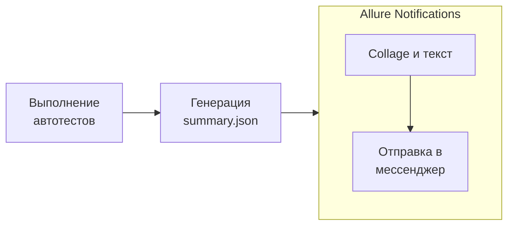
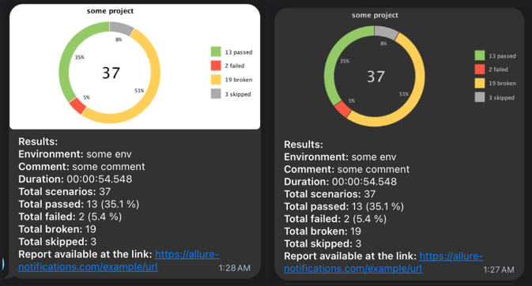
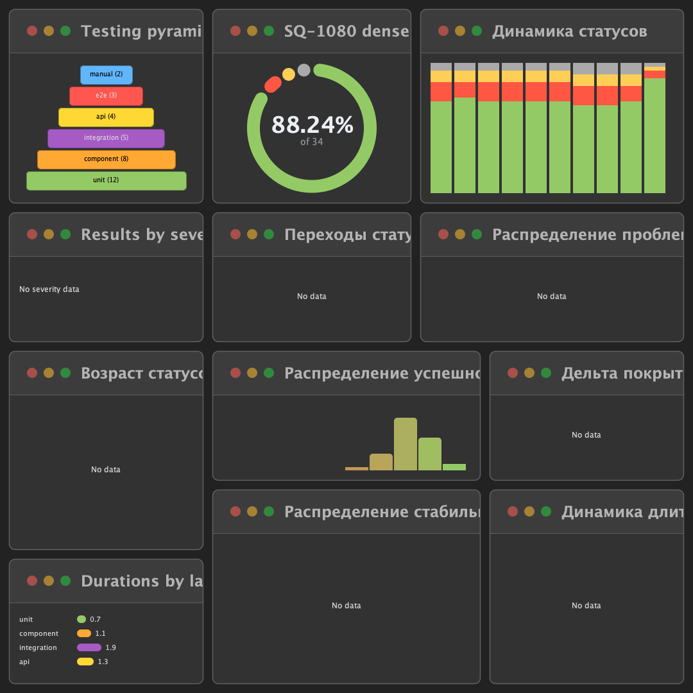
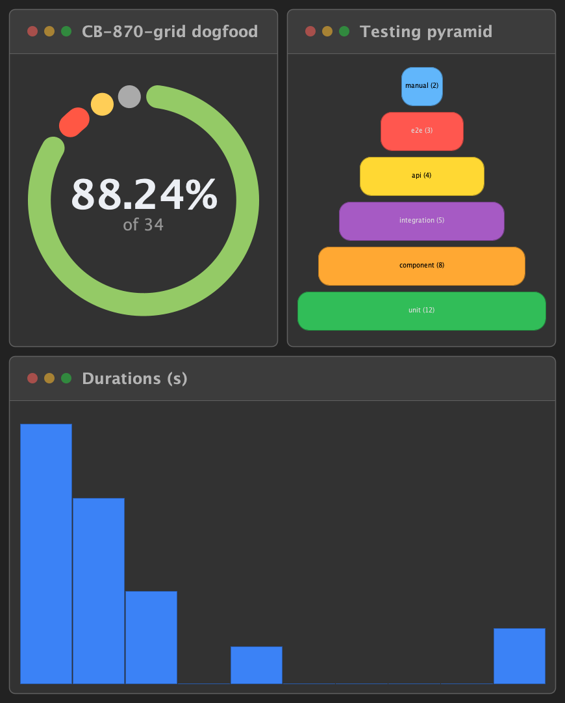

[](README.md) [](#) [](README.fr.md)

| Линия | Стек | Allure | Статус |
|-------|------|--------|--------|
| **4.\*** | Java | Allure 2 | Историческая |
| **5.\*** | Java | Allure 3 | Legacy freeze на **5.0.8** (`legacy/java/`); линии **5.1 нет** |
| **6.\*** | TypeScript | Allure 3 | **Продукт** — pin **6.0.8** (CLI + builder + plugin) |

Патч-ноты → [GitHub Releases](https://github.com/qa-guru/allure-notifications/releases) · миграция → [`MIGRATION.md`](MIGRATION.md).

# Allure notifications

CLI: отчёт Allure → уведомление в мессенджер (текст + опциональный collage PNG).

Мессенджеры: Telegram, Slack, Email, Mattermost, Discord, Loop, Rocket.Chat, Zoho Cliq, Microsoft Teams.  
Языки: 🇬🇧 🇫🇷 🇷🇺 🇺🇦 🇧🇾 🇨🇳

Соберите `config.json` в [Config builder](#config-builder), затем отправьте через CLI.

## Содержание

+ [Что нового в 6.0](#что-нового-в-60)
+ [Принцип работы](#принцип-работы)
+ [Quick start](#quick-start)
+ [config.json](#configjson)
+ [Config builder](#config-builder)
+ [Визуальный канон](#визуальный-канон)
+ [Плагин (альтернатива)](#плагин-альтернатива)
+ [Legacy Java 5.0.8](#legacy-java-508)
+ [CI cookbook](#ci-cookbook)

## Что нового в 6.0

| Часть | Роль |
|-------|------|
| **CLI** | `npx allure-notifications@6.0.8 send --config …` — основной runtime |
| **Collage PNG** | `@napi-rs/canvas` в `@allure-notifications/core` (Playwright — только тесты) |
| **Config builder** | Web UI → полный `config.json` + free-layout collage — [`apps/builder/`](apps/builder/) |
| **Пакеты** | `@allure-notifications/config` · `pyramid` · `core` · bin `allure-notifications` · plugin `@allure-notifications/plugin` |
| **Плагин Allure 3** | Альтернативный `done` hook — см. [Плагин](#плагин-альтернатива) |

## Принцип работы

После тестов Allure пишет summary. CLI находит его автоматически:

- **Allure 2** — `<allureFolder>/widgets/summary.json`
- **Allure 3** — `<allureFolder>/summary.json`

По summary строится текст уведомления. В режиме collage дополнительно читаются `*-result.json` из `allureResultsFolder` (пирамида, сьюты, длительности и др.).


```mermaid
flowchart LR
    A[Выполнение\nавтотестов] --> B[Генерация\nsummary.json]
    B --> C
    subgraph C[Allure Notifications]
        D[Collage и текст] --> E[Отправка в\nмессенджер]
    end
```

Пример уведомления (Telegram):



## Quick start

```bash
npx allure generate allure-results --clean -o allure-report
npx allure-notifications@6.0.8 send --config config.json --live
```

| Флаг | Поведение |
|------|----------|
| `--dry-run` | Рендер collage; список мессенджеров без сети (PR / локально без секретов) |
| `--mock` | Рендер collage; mock-доставки; **без сети** |
| `--live` | Реальная отправка (Telegram при наличии credentials) |
| `--out <png>` | Записать collage PNG на диск |

Без `--live` / `--mock` по умолчанию безопасный **dry-run**.

## config.json

Схема: [`packages/config`](packages/config) (zod). Удобнее всего Export из [Config builder](#config-builder).

Минимальный пример **6.0** — collage + free + один мессенджер:

```json
{
  "base": {
    "project": "my-project",
    "environment": "ci",
    "comment": "",
    "language": "ru",
    "allureFolder": "allure-report/",
    "allureResultsFolder": "allure-results/",
    "enableChart": true,
    "darkMode": true,
    "chart": {
      "mode": "collage",
      "layout": "free",
      "width": 870,
      "height": 1080,
      "headerHeight": 22,
      "cardGap": 14,
      "tilePad": 6,
      "gridCols": 10,
      "gridRows": 10,
      "items": [
        { "type": "pie", "x": 0, "y": 0, "w": 4, "h": 4 },
        { "type": "durationDynamics", "x": 4, "y": 0, "w": 6, "h": 4 },
        { "type": "testingPyramid", "x": 0, "y": 4, "w": 3, "h": 3 },
        { "type": "durations", "x": 3, "y": 4, "w": 4, "h": 3, "groupBy": "layer" }
      ],
      "pyramidFallback": "suites"
    },
    "links": {
      "report": "${ALLURE_REPORT_URL}",
      "dashboard": "${ALLURE_DASHBOARD_URL}",
      "testops": "",
      "build": "${BUILD_URL}"
    }
  },
  "telegram": {
    "token": "${TELEGRAM_BOT_TOKEN}",
    "chat": "${TELEGRAM_CHAT_ID}",
    "topic": "",
    "templatePath": "/templates/telegram.ftl"
  }
}
```

### Поля `base`

| Поле | Заметки |
|------|--------|
| `project`, `environment`, `comment` | В тексте уведомления |
| `links` | `report`, `dashboard`, `testops`, `build` — только непустые |
| `reportLink` | **Deprecated** — используйте `links.report` (fallback ещё работает) |
| `language` | `en` / `fr` / `ru` / `ua` / `by` / `cn` / `cnt` |
| `allureFolder` | Каталог сгенерированного отчёта Allure |
| `allureResultsFolder` | Сырые `allure-results` (нужны для analytics collage) |
| `enableChart` | Прикреплять изображение collage / chart |
| `chart.mode` | `collage` (основной) или `pie` |
| `chart.layout` | Основной путь — **`free` + `items`**. Legacy `grid` \| `stacked` \| `row` ещё поддерживаются |
| `chart.width` / `height` | Размер canvas (px) |
| `chart.headerHeight` / `cardGap` / `tilePad` | Chrome карточек (defaults builder: 22 / 14 / 6) |
| `darkMode` | Тема chart |
| `enableSuitesPublishing` | Статистика по suites из `suites.json` |
| `logo`, `durationFormat`, `customData` | Опционально |

### Мессенджеры

Оставьте `base` и только нужный блок мессенджера. `templatePath` — опциональный путь к своему Freemarker-шаблону.

**Telegram** — [wiki](https://github.com/qa-guru/knowledge-base/wiki/12.-Телеграм-бот.-Отправляем-уведомления-о-результатах-прохождения-тестов): `token`, `chat`, опционально `topic` / `replyTo`.

**Slack** — [wiki](https://github.com/qa-guru/allure-notifications/wiki/Slack-configuration): `token`, `chat`, опционально `replyTo`.

**Email** — [wiki](https://github.com/qa-guru/allure-notifications/wiki/Email-configuration): `host`, `port`, `username`, `password`, `from`, `to`, опционально `cc` / `bcc` / `securityProtocol`.

**Mattermost** — [wiki](https://github.com/qa-guru/allure-notifications/wiki/Mattermost-configuration): `url`, `token`, `chat`.

<details>
<summary>Discord</summary>

`botToken`, `channelId`. Developer mode → Discord developer portal → Applications → Bot token; ПКМ по каналу → Copy ID.
</details>

<details>
<summary>Loop</summary>

`webhookUrl` — Integrations → Incoming Webhooks → создать webhook для канала.
</details>

<details>
<summary>Rocket.Chat</summary>

`url`, `auth_token`, `user_id`, `channel`. Токен в настройках пользователя (там же `user_id`).
</details>

<details>
<summary>Zoho Cliq</summary>

`token` (zapikey), `chat`, опционально `bot`, `dataCenter` (`com` / `eu` / `in` / `au` / `jp` / `ca`; default `eu`).
</details>

<details>
<summary>Microsoft Teams</summary>

`webhookUrl` из шаблона Workflows *“Post to a channel when a webhook request is received”* (legacy Office 365 Connectors уходят). Chart — base64; payload ≤ 28 KB; throttle ~4 req/s.
</details>

Опциональный top-level `proxy` (`type`: `http` \| `socks5`, `host`, `port`, …) для исходящего HTTP/SOCKS где поддерживается.

## Config builder

Web UI: полный `config.json` (`base` · `chart` · `links` · messengers) + редактор free-layout collage.

| | |
|--|--|
| **Prod** | [allure-notifications.qa.guru](https://allure-notifications.qa.guru/) |
| **Project Pages** | [qa-guru.github.io/allure-notifications](https://qa-guru.github.io/allure-notifications/) |
| **Исходники** | [`apps/builder/`](apps/builder/) |
| **Canon** | [`apps/builder/CANON.md`](apps/builder/CANON.md) |

### Canvas presets

| Preset | Размер | Заметки |
|--------|--------|--------|
| **SQ-1080** | 1080×1080 | Dense 12-tile, квадратный canvas |
| **CB-870** | 870×1080 | Canvas под Telegram (post cap 1024×1280) |
| **WD-1410** | 1410×1080 | Широкий canvas |

### Export → CLI

1. Раскладка панелей в builder → **Export** / Download `config.json`.
2. Укажите `base.allureFolder` / `base.allureResultsFolder`.
3. Заполните credentials мессенджера (или env-плейсхолдеры).
4. Отправка:

```bash
npx allure-notifications@6.0.8 send --config <exported>.json
```

### Локальный стенд (monorepo)

```bash
python scripts/stands/ensure.py allure-notifications-builder
```

Статический builder: [http://localhost:3011/](http://localhost:3011/).

### Превью collage




## Визуальный канон

Правила collage и reference PNG: [`docs/canon/CANON.md`](docs/canon/CANON.md).

## Плагин (альтернатива)

Плагин Allure 3 — тонкая обёртка над тем же core. Основной путь — CLI.

```bash
npm add allure @allure-notifications/plugin@6.0.8
```

- Документация: [`packages/plugin/README.md`](packages/plugin/README.md)
- Пример: [`examples/allurerc.notifications.mjs`](examples/allurerc.notifications.mjs)
- GitHub Actions: [`examples/github-actions/`](examples/github-actions/)

## Legacy Java 5.0.8

Только bugfix / security. Сборка: [`legacy/java/`](legacy/java/).

```bash
java -DconfigFile=notifications/config.json -jar allure-notifications-5.0.8.jar
```

Релиз: [v5.0.8](https://github.com/qa-guru/allure-notifications/releases/tag/v5.0.8) · заметки 4.x → 5.0: [`docs/migration-5.0.md`](docs/migration-5.0.md).

## CI cookbook

[`docs/ci-cookbook.md`](docs/ci-cookbook.md) · заметки эпохи jar: [`docs/ci-cookbook-5.0.md`](docs/ci-cookbook-5.0.md).
